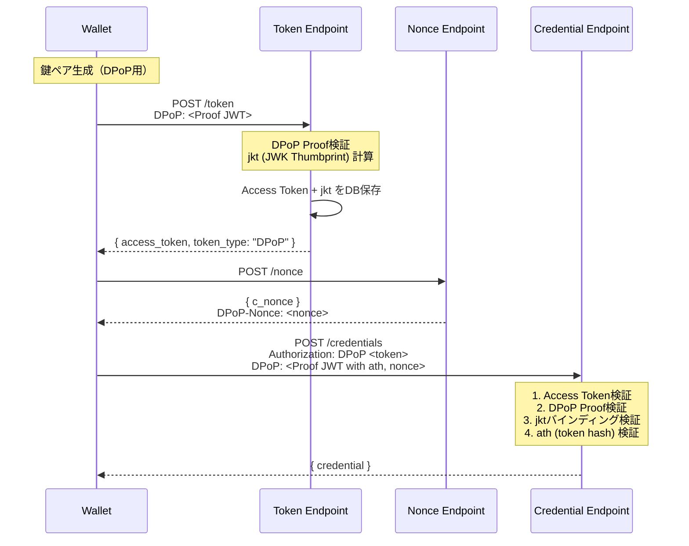
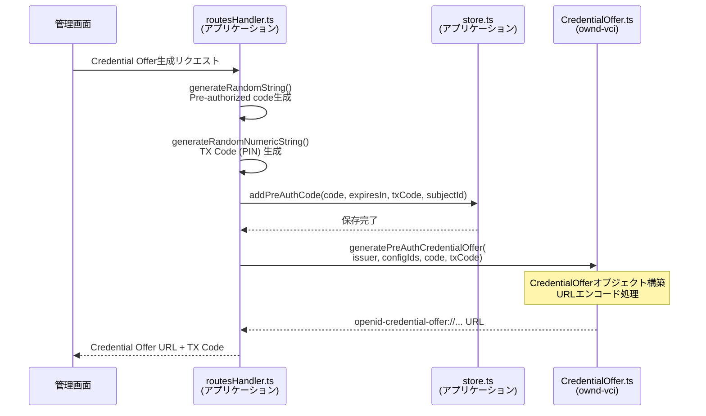
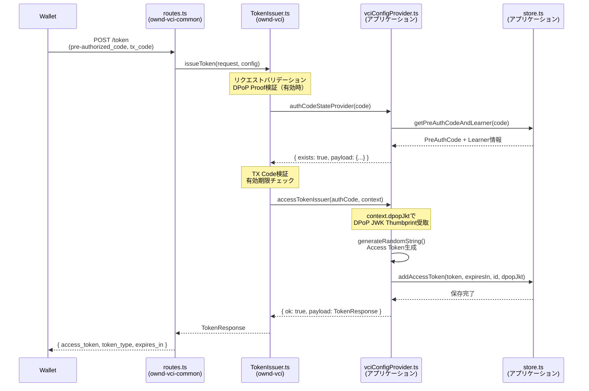
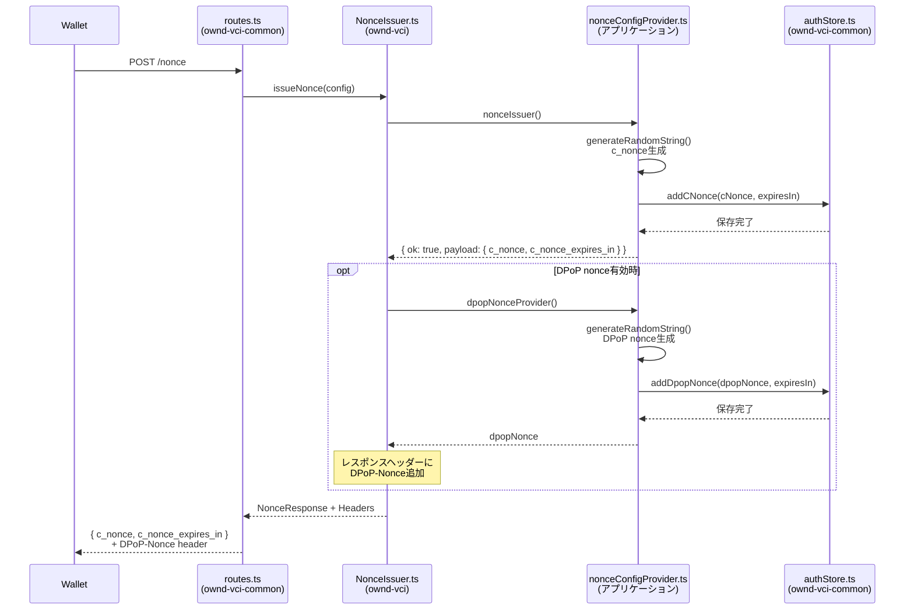
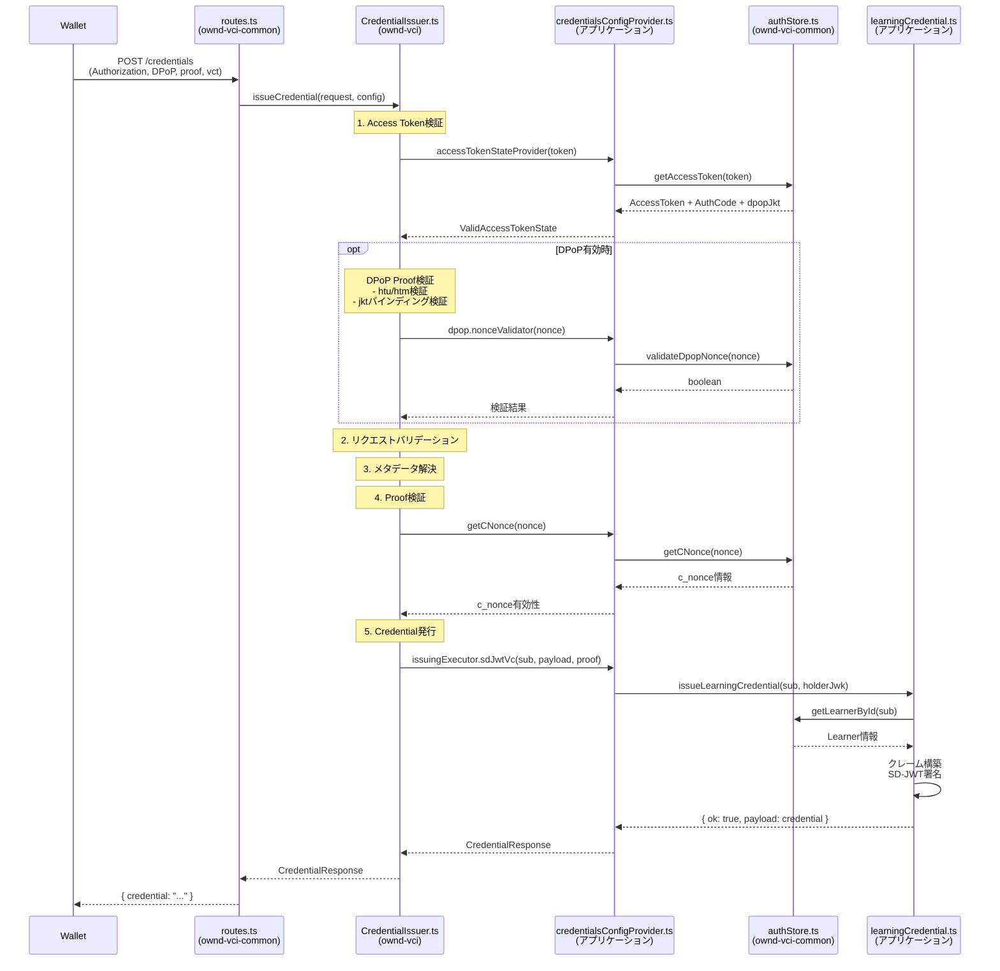

# OID4VCI モジュール

## 概要
OID4VCIプロトコルのエンドポイント実装を提供する。本モジュールはライブラリとして設計されており、実装者が提供するコールバック関数を通じて永続化やビジネスロジックをカスタマイズできる。

コード例は [learning-vci](../demos/learning-vci.md) デモアプリケーションから引用している。

## 目次

1. [アーキテクチャ](#アーキテクチャ)
2. [DPoP（Demonstrating Proof of Possession）](#dpopdemonstrating-proof-of-possession)
3. [コンポーネント詳細](#コンポーネント詳細)
   - [CredentialOffer](#credentialoffer)
   - [TokenIssuer](#tokenissuer)
   - [NonceIssuer](#nonceissuer)
   - [CredentialIssuer](#credentialissuer)
4. [VCIエンドポイントの設定](#vciエンドポイントの設定)
5. [型定義](#型定義)
6. [エラーコード](#エラーコード)
7. [環境変数](#環境変数)

## アーキテクチャ

```
┌─────────────────────────────────────────────────────────────┐
│                    実装者のアプリケーション                      │
├─────────────────────────────────────────────────────────────┤
│  TokenIssuerConfig   │ CredentialIssuerConfig │ NonceConfig │
│  - authCodeProvider  │ - accessTokenProvider  │ - issuer    │
│  - tokenIssuer       │ - issuingExecutor      │             │
└──────────┬───────────┴──────────┬─────────────┴──────┬──────┘
           │                      │                    │
           ▼                      ▼                    ▼
┌──────────────────┐  ┌─────────────────────┐  ┌─────────────┐
│   TokenIssuer    │  │  CredentialIssuer   │  │ NonceIssuer │
│   (本ライブラリ)   │  │   (本ライブラリ)     │  │(本ライブラリ)│
└──────────────────┘  └─────────────────────┘  └─────────────┘
```

### Pre-Authorized Code Flow

```
  Issuer                                              Wallet
    │                                                   │
    │  1. Credential Offer (QRコード/ディープリンク)      │
    │ ─────────────────────────────────────────────────>│
    │                                                   │
    │  2. GET /.well-known/openid-credential-issuer     │
    │ <─────────────────────────────────────────────────│
    │       Issuer Metadata                             │
    │ ─────────────────────────────────────────────────>│
    │                                                   │
    │  3. POST /token (pre-authorized_code + tx_code)   │
    │ <─────────────────────────────────────────────────│
    │       Access Token                                │
    │ ─────────────────────────────────────────────────>│
    │                                                   │
    │  4. POST /nonce                                   │
    │ <─────────────────────────────────────────────────│
    │       c_nonce                                     │
    │ ─────────────────────────────────────────────────>│
    │                                                   │
    │  5. POST /credentials (Access Token + Proof)      │
    │ <─────────────────────────────────────────────────│
    │       Verifiable Credential                       │
    │ ─────────────────────────────────────────────────>│
    │                                                   │
```

---

## DPoP（Demonstrating Proof of Possession）

本ライブラリはRFC 9449に準拠したDPoP（Demonstrating Proof of Possession）をサポートしている。DPoPにより、Access Tokenの不正使用（トークン漏洩時の悪用）を防止できる。

### DPoP対応フロー



### Access Tokenの実装方式

RFC 9449では、DPoP-boundなAccess Tokenの確認方法（Confirmation Method）として以下の2つが定義されている。

| 方式 | RFCセクション | Access Token形式 | jkt（JWK Thumbprint）の格納場所 | 検証方法 |
|------|--------------|-----------------|-------------------------------|----------|
| JWT方式 | Section 6.1 | JWT | トークン内の`cnf.jkt`クレーム | トークン自己検証 |
| Introspection方式 | Section 6.2 | Opaque | Token Introspectionレスポンス | 認可サーバーへの問い合わせ |

#### 本ライブラリの実装: Opaqueトークン + DB参照

本ライブラリでは**Opaqueトークン**を採用している。

RFC 9449 Section 6.2では、Opaqueトークンの場合はリソースサーバーが認可サーバーのToken Introspectionエンドポイントに問い合わせて`cnf.jkt`を取得する方式が定義されている。しかし、本ライブラリでは認可サーバー（Token Endpoint）とリソースサーバー（Credential Endpoint）が同一サーバーで動作することを想定しているため、**Token Introspectionの代わりにDB参照**でjktを取得している。

```
┌─────────────────────────────────────────────────────────────────┐
│ Token Endpoint                                                  │
├─────────────────────────────────────────────────────────────────┤
│  1. DPoP Proof検証 → jkt (thumbprint) 計算                      │
│  2. context.dpopJkt としてコールバックに渡す                      │
│  3. アプリケーション側:                                          │
│     - generateRandomString() でオペークトークン生成              │
│     - jktをDBに保存（access_tokensテーブル）                     │
│  4. レスポンス: { access_token: "xxx", token_type: "DPoP" }     │
└─────────────────────────────────────────────────────────────────┘

┌─────────────────────────────────────────────────────────────────┐
│ Credential Endpoint                                             │
├─────────────────────────────────────────────────────────────────┤
│  1. Access Tokenをキーにしてdbからjktを取得                       │
│     （accessTokenStateProvider経由）                             │
│  2. DPoP Proofのthumbprintと保存済みjktを比較                    │
│  3. 一致すればトークンバインディング検証成功                        │
└─────────────────────────────────────────────────────────────────┘
```

#### クライアント（Wallet）への影響

**どちらの方式でもクライアントの動作は同一**である。クライアントはAccess Tokenの内部構造を解釈せず、opaqueな文字列として扱う。

```typescript
// クライアント側の動作（方式によらず同じ）

// 1. Token Endpoint
POST /token
DPoP: <DPoP Proof JWT>
→ { access_token: "xxx", token_type: "DPoP" }

// 2. Credential Endpoint
POST /credentials
Authorization: DPoP xxx
DPoP: <DPoP Proof JWT with ath>
```

#### 方式選択の考慮点

| 観点 | JWT方式 | Introspection方式 | 本実装（DB参照） |
|------|---------|-------------------|-----------------|
| 外部リソースサーバー | 自己検証可能 | Introspection必要 | 非対応 |
| 同一サーバー | どちらでも可 | どちらでも可 | 対応 |
| トークンサイズ | 大きい | 小さい | 小さい |
| 実装の複雑さ | JWT署名が必要 | Introspection実装必要 | シンプル |

本ライブラリは同一サーバー構成を想定しているため、DB参照方式を採用している。外部リソースサーバーとの連携が必要な場合は、JWT方式またはToken Introspectionエンドポイントの実装が必要となる。

### 関連ファイル

| ファイル | 説明 |
|----------|------|
| [`src/oid4vci/dpop/validateDpopProof.ts`](../../src/oid4vci/dpop/validateDpopProof.ts) | DPoP Proof検証（RFC 9449 Section 4.3準拠） |
| [`src/oid4vci/dpop/utils.ts`](../../src/oid4vci/dpop/utils.ts) | JWK Thumbprint計算、ath計算等 |
| [`src/oid4vci/dpop/types.ts`](../../src/oid4vci/dpop/types.ts) | DPoP関連の型定義 |

---

## コンポーネント詳細

### CredentialOffer

**ファイル**: [`src/oid4vci/CredentialOffer.ts`](../../src/oid4vci/CredentialOffer.ts)

Credential Offer URLの生成・パースを行うユーティリティ。Walletに対してCredential発行を開始するためのURLを生成する。

#### 主要関数

```typescript
// Credential OfferオブジェクトをURLに変換
credentialOffer2Url(offer: CredentialOffer, endpoint?: string): string

// URLからCredential Offerオブジェクトを抽出
url2CredentialOffer(url: string): CredentialOffer

// Pre-Authorized Code Flow用のOffer URLを生成
generatePreAuthCredentialOffer(
  credentialIssuer: string,
  credentialConfigurationIds: string[],
  preAuthCode: string,
  txCode?: TxCode,
  endpoint?: string
): string
```

#### モジュール連携シーケンス



#### 実装例

```typescript
// demos/learning-vci/src/routes/admin/routesHandler.ts より引用
import { generatePreAuthCredentialOffer } from "ownd-vci/dist/oid4vci/CredentialOffer.js";
import {
  generateRandomNumericString,
  generateRandomString,
} from "ownd-vci/dist/utils/randomStringUtils.js";

const generateCredentialOffer = async (subjectId: string) => {
  // 1. Pre-authorized codeを生成
  const code = generateRandomString();
  const expiresIn = Number(process.env.VCI_PRE_AUTH_CODE_EXPIRES_IN || "86400");

  // 2. TX Code (PIN) を生成
  const txCode = generateRandomNumericString(6);

  // 3. DBに保存
  await store.addPreAuthCode(code, expiresIn, txCode, subjectId);

  // 4. Credential Offer URLを生成
  const credentialOfferUrl = generatePreAuthCredentialOffer(
    process.env.CREDENTIAL_ISSUER || "",
    ["LearningCredential"],  // credential_configuration_ids
    code,
    { length: 6, input_mode: "numeric" },  // tx_code設定
  );

  return {
    credentialOffer: credentialOfferUrl,
    txCode: txCode,
  };
};
```

**生成されるCredential Offer URL例:**

```
openid-credential-offer://?credential_offer=%7B%22credential_issuer%22%3A%22https%3A%2F%2Fexample.com%22%2C%22credential_configuration_ids%22%3A%5B%22LearningCredential%22%5D%2C%22grants%22%3A%7B%22urn%3Aietf%3Aparams%3Aoauth%3Agrant-type%3Apre-authorized_code%22%3A%7B%22pre-authorized_code%22%3A%22abc123...%22%2C%22tx_code%22%3A%7B%22length%22%3A6%2C%22input_mode%22%3A%22numeric%22%7D%7D%7D%7D
```

---

### TokenIssuer

**ファイル**: [`src/oid4vci/tokenEndpoint/TokenIssuer.ts`](../../src/oid4vci/tokenEndpoint/TokenIssuer.ts)

Pre-authorized codeを検証し、Access Tokenを発行する。

#### 処理フロー
1. リクエストのバリデーション（`validate.ts`）
2. `AuthCodeStateProvider`で認可コードの状態を取得
3. `AccessTokenIssuer`でAccess Tokenを発行

#### Config型

```typescript
interface TokenIssuerConfig {
  // 認可コードの状態を取得するコールバック
  authCodeStateProvider: AuthCodeStateProvider;
  // Access Tokenを発行するコールバック
  accessTokenIssuer: AccessTokenIssuer;
  // DPoP設定（オプション）
  dpop?: DpopConfig;
  // Token EndpointのURL（DPoP有効時に必須、htu検証用）
  tokenEndpointUrl?: string;
}

interface DpopConfig {
  enabled: boolean;              // DPoPサポートを有効化
  required?: boolean;            // 全リクエストでDPoPを必須化（デフォルト: false）
  allowedAlgorithms?: string[];  // 許可する署名アルゴリズム
  iatToleranceSeconds?: number;  // iat許容範囲（デフォルト: 300秒）
}

// Access Token発行時のコンテキスト（DPoPバインディング等）
interface TokenIssuanceContext {
  dpopJkt?: string;  // DPoP JWK Thumbprint（DPoP Proof検証成功時に設定）
}

// 認可コードの存在と状態を返す
type AuthCodeStateProvider = (
  authorizedCode: string,
) => Promise<NotExists | Exists<PayloadAtExists>>;

// Access Tokenを発行して返す（contextでDPoP情報を受け取る）
type AccessTokenIssuer = (
  authorizedCode: AuthorizedCodeWithStoredData,
  context?: TokenIssuanceContext,
) => Promise<Result<TokenResponse, ErrorPayload>>;
```

#### モジュール連携シーケンス



#### 実装例（DPoP対応）

**ファイル:** `src/logic/vciConfigProvider.ts`

```typescript
// demos/learning-vci/src/logic/vciConfigProvider.ts より引用
import { generateRandomString } from "ownd-vci/dist/utils/randomStringUtils.js";
import store from "../store.js";
import {
  AccessTokenIssuer,
  AuthCodeStateProvider,
  AuthorizedCodeWithStoredData,
  TokenIssuerConfig,
  TokenIssuanceContext,
} from "ownd-vci/dist/oid4vci/tokenEndpoint/types.js";

/**
 * 認可コードの状態を提供するコールバック
 * pre-authorized_codeがDBに存在するか、使用済みかを確認する
 */
export const authCodeStateProvider: AuthCodeStateProvider = async (
  authorizedCode: string,
) => {
  const result = await store.getPreAuthCodeAndLearner(authorizedCode);
  if (!result) {
    return { exists: false };
  }
  const { storedAuthCode } = result;
  const { usedAt, ...rest } = storedAuthCode;
  return {
    exists: true,
    payload: {
      authorizedCode: {
        ...rest,
        isUsed: usedAt !== null,
        storedData: { id: storedAuthCode.id },
      },
    },
  };
};

/**
 * Access Tokenを発行するコールバック
 * DPoP Proof検証成功時はcontext.dpopJktが設定される
 */
export const accessTokenIssuer: AccessTokenIssuer = async (
  authorizedCode: AuthorizedCodeWithStoredData,
  context?: TokenIssuanceContext,
) => {
  const newAccessToken = generateRandomString();
  const expiresIn = Number(process.env.VCI_ACCESS_TOKEN_EXPIRES_IN);

  try {
    // DPoP JWK Thumbprint (jkt) をAccess Tokenと共に保存
    // Credential Endpoint呼び出し時にトークンバインディング検証に使用
    await store.addAccessToken(
      newAccessToken,
      expiresIn,
      authorizedCode.storedData.id,
      context?.dpopJkt,  // DPoP使用時に設定される
    );

    return {
      ok: true,
      payload: {
        access_token: newAccessToken,
        // DPoP使用時は"DPoP"、それ以外は"Bearer"
        token_type: context?.dpopJkt ? "DPoP" : "Bearer",
        expires_in: expiresIn,
      },
    };
  } catch (err) {
    console.error(err);
    return {
      ok: false,
      error: { error: "INTERNAL_ERROR", internalError: true },
    };
  }
};

/**
 * TokenIssuer設定を生成（DPoP有効）
 */
export const tokenConfigure = (): TokenIssuerConfig => {
  return {
    authCodeStateProvider,
    accessTokenIssuer,
    // DPoP設定
    dpop: {
      enabled: true,
      required: false,  // DPoPはオプション（Bearer Tokenも許可）
    },
    tokenEndpointUrl: process.env.CREDENTIAL_ISSUER + "/token",
  };
};
```

**ポイント:**
- `authCodeStateProvider`: DBから認可コードを取得し、存在・使用状態を返す
- `accessTokenIssuer`: Access Token発行時に`context.dpopJkt`でDPoP JWK Thumbprintを受け取り、DBに保存
- `tokenConfigure`: `dpop.enabled: true`でDPoPサポートを有効化、`tokenEndpointUrl`はhtu検証に使用

---

### NonceIssuer

**ファイル**: [`src/oid4vci/nonceEndpoint/NonceIssuer.ts`](../../src/oid4vci/nonceEndpoint/NonceIssuer.ts)

c_nonceを発行する。Credential Endpoint呼び出し前に必須。

#### Config型

```typescript
interface NonceIssuerConfig {
  // c_nonceを生成するコールバック
  nonceIssuer: NonceIssuer;
  // DPoP nonce生成（オプション）- DPoP-Nonceヘッダー用
  dpopNonceProvider?: () => Promise<string>;
}

type NonceIssuer = () => Promise<Result<NonceResponse, ErrorPayload>>;
```

**DPoP nonce**: `dpopNonceProvider`を設定すると、レスポンスに`DPoP-Nonce`ヘッダーが追加される。Credential Endpointでのnonce検証に使用される。

#### モジュール連携シーケンス



#### 実装例（DPoP nonce対応）

**ファイル:** `src/logic/nonceConfigProvider.ts`

```typescript
// demos/learning-vci/src/logic/nonceConfigProvider.ts より引用
import { generateRandomString } from "ownd-vci/dist/utils/randomStringUtils.js";
import authStore from "ownd-vci-common/dist/store/authStore.js";
import {
  NonceIssuer,
  NonceIssuerConfig,
} from "ownd-vci/dist/oid4vci/nonceEndpoint/types.js";

/**
 * c_nonceを発行するコールバック
 */
export const nonceIssuer: NonceIssuer = async () => {
  try {
    const cNonce = generateRandomString();
    const cNonceExpiresIn = Number(process.env.VCI_ACCESS_TOKEN_C_NONCE_EXPIRES_IN);

    await authStore.addCNonce(cNonce, cNonceExpiresIn);

    return {
      ok: true,
      payload: {
        c_nonce: cNonce,
        c_nonce_expires_in: cNonceExpiresIn,
      },
    };
  } catch (err) {
    console.error(err);
    return {
      ok: false,
      error: { error: "INTERNAL_ERROR", internalError: true },
    };
  }
};

/**
 * DPoP nonceを発行するコールバック
 * レスポンスのDPoP-Nonceヘッダーに設定される
 */
const dpopNonceProvider = async (): Promise<string> => {
  const dpopNonce = generateRandomString();
  const expiresIn = Number(process.env.VCI_DPOP_NONCE_EXPIRES_IN || "300");
  await authStore.addDpopNonce(dpopNonce, expiresIn);
  return dpopNonce;
};

/**
 * NonceIssuer設定を生成（DPoP nonce対応）
 */
export const nonceConfigure = (): NonceIssuerConfig => {
  return {
    nonceIssuer,
    // DPoP nonce生成（レスポンスにDPoP-Nonceヘッダーを追加）
    dpopNonceProvider,
  };
};
```

**ポイント:**
- `dpopNonceProvider`: DPoP nonce（`DPoP-Nonce`ヘッダー用）を生成してDBに保存
- Credential Endpoint呼び出し時にDPoP Proofの`nonce`クレームで使用される

---

### CredentialIssuer

**ファイル**: [`src/oid4vci/credentialEndpoint/CredentialIssuer.ts`](../../src/oid4vci/credentialEndpoint/CredentialIssuer.ts)

Access Tokenを検証し、Credentialを発行する。

#### 処理フロー
1. `Authorization`ヘッダーからAccess Tokenを検証（`authenticate.ts`）
2. リクエストボディのバリデーション
3. `credential_configuration_id`からメタデータを解決
4. Proof（Key Binding）の検証（`validateProof.ts`）
   - JWT形式のProofをサポート
   - c_nonceの検証（`getCNonce`コールバック使用）
5. フォーマットに応じた発行処理を実行

#### サポートするCredentialフォーマット
| フォーマット | 状態 |
|-------------|------|
| `dc+sd-jwt` | サポート |
| `jwt_vc_json` | サポート |
| `ldp_vc` | 未サポート |
| `jwt_vc_json-ld` | 未サポート |

#### Config型

```typescript
interface CredentialIssuerConfig<T> {
  credentialIssuer: string;           // Issuer識別子URL
  issuerMetadata: IssuerMetadata;     // Issuerメタデータ
  supportAnonymousAccess?: boolean;   // 匿名アクセスのサポート

  // Access Tokenの状態を取得するコールバック
  accessTokenStateProvider: AccessTokenStateProvider<T>;

  // Credential発行を実行するコールバック
  issuingExecutor: {
    jwtVcJson?: IssueJwtVcJsonCredential;
    sdJwtVc?: IssueSdJwtVcCredential;
  };

  // c_nonceを検証するためのコールバック
  getCNonce?: (nonce: string) => Promise<{
    nonce: string;
    expired_in: number;
    createdAt: string;
  } | undefined>;

  // DPoP設定（オプション）
  dpop?: CredentialDpopConfig;
}

// Credential Endpoint用DPoP設定
interface CredentialDpopConfig {
  enabled: boolean;                   // DPoPサポートを有効化
  required?: boolean;                 // DPoP必須化（デフォルト: false、トークンバインディングに従う）
  allowedAlgorithms?: string[];       // 許可する署名アルゴリズム
  iatToleranceSeconds?: number;       // iat許容範囲（デフォルト: 300秒）
  credentialEndpointUrl: string;      // Credential EndpointのURL（htu検証用）
  // DPoP nonce検証（Nonce Endpointで発行されたnonceを検証）
  nonceValidator?: (nonce: string) => Promise<boolean>;
}

// Access Tokenの状態（DPoPバインディング情報を含む）
interface ValidAccessTokenState<T> {
  expiresIn: number;
  createdAt: Date;
  authorizedCode: { code: string; sub: string };
  storedAccessToken: T;
  dpopJkt?: string;  // DPoP JWK Thumbprint（トークン発行時にバインドされた鍵）
}
```

#### Proof検証（validateProof.ts）

JWT形式のProofを検証する。検証項目:
- `typ`: `openid4vci-proof+jwt`であること
- `jwk`: ヘッダーに公開鍵が含まれること
- `aud`: Credential Issuer URLと一致すること
- `iat`: 現在時刻から許容範囲内であること（5秒）
- `nonce`: c_nonceが有効かつ未期限であること

#### モジュール連携シーケンス



#### 実装例（DPoP対応）

**ファイル:** `src/logic/credentialsConfigProvider.ts`

```typescript
// demos/learning-vci/src/logic/credentialsConfigProvider.ts より引用
import authStore, { StoredAccessToken } from "ownd-vci-common/dist/store/authStore.js";
import {
  CredentialIssuerConfig,
  IssueSdJwtVcCredential,
  DecodedProofJwt,
} from "ownd-vci/dist/oid4vci/credentialEndpoint/types.js";
import {
  CredentialRequestVcSdJwt,
  IssuerMetadataVcSdJwt,
} from "ownd-vci/dist/oid4vci/types/protocol.types.js";

import learningCredential from "./learningCredential.js";
import { accessTokenStateProvider } from "ownd-vci-common/dist/oid4vci/credentialEndpoint/defaults/accessToken.js";

/**
 * SD-JWT VC発行関数
 * vctに応じて適切なCredential発行ロジックを呼び出す
 */
const issueSdJwtVcCredential: IssueSdJwtVcCredential = async (
  sub: string,
  payload: CredentialRequestVcSdJwt,
  proofOfPossession?: DecodedProofJwt,
) => {
  // Proofの検証
  if (
    !proofOfPossession ||
    !proofOfPossession.jwt?.header?.jwk
  ) {
    return { ok: false, error: { error: "invalid_or_missing_proof" } };
  }

  const vct = payload.vct;

  // vctに応じて発行処理を分岐
  if (vct === "urn:eu.europa.ec.eudi:learning:credential:1") {
    return await learningCredential.issueLearningCredential(
      sub,
      proofOfPossession.jwt.header.jwk,
    );
  } else {
    return { ok: false, error: { error: "unsupported_credential_type" } };
  }
};

/**
 * Issuerメタデータ定義
 */
const issuerMetadata: IssuerMetadataVcSdJwt = {
  credential_issuer: process.env.CREDENTIAL_ISSUER || "",
  credential_endpoint: `${process.env.CREDENTIAL_ISSUER}/credentials`,
  credential_configurations_supported: {
    LearningCredential: {
      format: "dc+sd-jwt",
      scope: "LearningCredential",
      vct: "urn:eu.europa.ec.eudi:learning:credential:1",
      // 他の設定...
    },
  },
};

/**
 * c_nonce検証用ラッパー
 */
const getCNonceWrapper = async (nonce: string) => {
  const result = await authStore.getCNonce(nonce);
  if (!result) return undefined;
  return { ...result, createdAt: result.createdAt.toString() };
};

/**
 * DPoP nonce検証用ラッパー
 * Nonce Endpointで発行されたDPoP nonceを検証
 */
const dpopNonceValidator = async (nonce: string): Promise<boolean> => {
  return await authStore.validateDpopNonce(nonce);
};

/**
 * CredentialIssuer設定を生成（DPoP有効）
 */
export const configure = (): CredentialIssuerConfig<StoredAccessToken> => {
  return {
    credentialIssuer: process.env.CREDENTIAL_ISSUER || "",
    issuerMetadata: issuerMetadata,
    supportAnonymousAccess: true,
    accessTokenStateProvider: accessTokenStateProvider,
    issuingExecutor: { sdJwtVc: issueSdJwtVcCredential },
    getCNonce: getCNonceWrapper,
    // DPoP設定
    dpop: {
      enabled: true,
      required: false,  // トークンバインディングに従う
      credentialEndpointUrl: process.env.CREDENTIAL_ISSUER + "/credentials",
      // DPoP nonce検証（Nonce Endpointで発行されたnonceを検証）
      nonceValidator: dpopNonceValidator,
    },
  };
};
```

**ポイント:**
- `accessTokenStateProvider`: Access Tokenの状態取得時に`dpopJkt`も取得（トークンバインディング検証用）
- `dpop.nonceValidator`: Nonce Endpointで発行されたDPoP nonceの有効性を検証
- `dpop.credentialEndpointUrl`: DPoP ProofのhtuクレームとHTTP URIの一致検証に使用

#### Credential発行ロジックの実装例

**ファイル:** `src/logic/learningCredential.ts`

```typescript
// demos/learning-vci/src/logic/learningCredential.ts より引用（簡略化）
import * as jose from "jose";
import { issueCredentialCore } from "@ownd-project/ts-toolbox";
import { DisclosureFrame } from "@meeco/sd-jwt";
import store from "../store.js";
import keyStore from "ownd-vci-common/dist/store/keyStore.js";

const issueLearningCredential = async (
  sub: string,
  holderJwk: jose.JWK,
) => {
  // 1. 発行対象のデータを取得
  const learner = await store.getLearnerById(sub);
  if (!learner) {
    return { ok: false, error: { error: "NotFound" } };
  }

  // 2. 署名鍵を取得
  const keyPair = await keyStore.getLatestKeyPair();
  if (!keyPair) {
    return { ok: false, error: { error: "No keypair exists" } };
  }

  // 3. クレームを構築
  const claims = {
    iss: process.env.CREDENTIAL_ISSUER_IDENTIFIER,
    iat: Math.floor(Date.now() / 1000),
    exp: Math.floor(Date.now() / 1000) + 60 * 60 * 24 * 365,
    vct: "urn:eu.europa.ec.eudi:learning:credential:1",
    cnf: { jwk: holderJwk },  // Holder Binding
    // Credentialのクレーム
    family_name: learner.familyName,
    given_name: learner.givenName,
    issuing_authority: learner.issuingAuthority,
    // 他のクレーム...
  };

  // 4. Selective Disclosure対象を指定
  const disclosureFrame: DisclosureFrame = {
    _sd: ["family_name", "given_name"],
  };

  // 5. SD-JWTを発行
  const credential = await issueCredentialCore(
    claims,
    disclosureFrame,
    keyPair,  // 署名鍵
    [],       // x5c証明書チェーン（空の場合はjwkモード）
  );

  return { ok: true, payload: credential };
};

export default { issueLearningCredential };
```

---

## VCIエンドポイントの設定

共通ルーティングを使用してVCIエンドポイントを設定する。

**ファイル:** `src/routes/vci/routes.ts`

```typescript
// demos/learning-vci/src/routes/vci/routes.ts より引用
import Router from "koa-router";
import commonVciRoutes from "ownd-vci-common/dist/routes/vci/routes.js";
import { fileURLToPath } from "url";
import { dirname } from "path";

import { tokenConfigure } from "../../logic/vciConfigProvider.js";
import { configure } from "../../logic/credentialsConfigProvider.js";
import { nonceConfigure } from "../../logic/nonceConfigProvider.js";
import { MetadataRepository } from "../../metadata/MetadataRepository.js";

const __filename = fileURLToPath(import.meta.url);
const __dirname = dirname(__filename).split("/src")[0];

const init = () => {
  const router = new Router();
  const credentialIssuer = process.env.CREDENTIAL_ISSUER || "http://localhost:3000";
  const metadataRepository = new MetadataRepository(credentialIssuer);

  // 共通VCIルートを設定
  // これにより以下のエンドポイントが自動設定される:
  // - GET  /.well-known/openid-credential-issuer
  // - GET  /.well-known/oauth-authorization-server
  // - POST /token
  // - POST /credentials
  // - POST /nonce
  commonVciRoutes.setupCommonRoute(
    router,
    tokenConfigure,
    configure,
    nonceConfigure,
    metadataRepository,
    __dirname,
  );

  return router;
};

export default init;
```

**設定されるエンドポイント:**

| メソッド | パス | 説明 |
|----------|------|------|
| GET | `/.well-known/openid-credential-issuer` | Issuerメタデータ |
| GET | `/.well-known/oauth-authorization-server` | Authorization Serverメタデータ |
| POST | `/token` | Access Token発行 |
| POST | `/credentials` | Credential発行 |
| POST | `/nonce` | c_nonce発行 |

### メタデータリポジトリの実装

`IMetadataRepository`インターフェースを実装して、Issuerメタデータを提供する。

**ファイル:** `src/metadata/MetadataRepository.ts`

```typescript
// demos/learning-vci/src/metadata/MetadataRepository.ts より引用
import { IMetadataRepository } from "ownd-vci/dist/metadata/IMetadataRepository.js";
import {
  IssuerMetadata,
  AuthorizationServerMetadata,
} from "ownd-vci/dist/oid4vci/types/protocol.types.js";
import { learningCredentialConfig } from "./credentialConfigs.js";

export class MetadataRepository implements IMetadataRepository {
  private credentialIssuer: string;

  constructor(credentialIssuer: string) {
    this.credentialIssuer = credentialIssuer;
  }

  async getIssuerMetadata(): Promise<IssuerMetadata> {
    return {
      credential_issuer: this.credentialIssuer,
      authorization_servers: [this.credentialIssuer],
      credential_endpoint: `${this.credentialIssuer}/credentials`,
      nonce_endpoint: `${this.credentialIssuer}/nonce`,
      display: this.buildDisplayInfo(),
      credential_configurations_supported: this.buildCredentialConfigurations(),
    };
  }

  async getAuthorizationServerMetadata(): Promise<AuthorizationServerMetadata> {
    return {
      issuer: this.credentialIssuer,
      authorization_endpoint: `${this.credentialIssuer}/authorize`,
      token_endpoint: `${this.credentialIssuer}/token`,
      grant_types_supported: [
        "urn:ietf:params:oauth:grant-type:pre-authorized_code",
      ],
      token_endpoint_auth_methods_supported: ["none"],
    };
  }

  private buildDisplayInfo() {
    return [
      {
        name: "Your Issuer Name",
        locale: "ja-JP",
        logo: { uri: `${this.credentialIssuer}/images/logo.png` },
      },
    ];
  }

  private buildCredentialConfigurations() {
    return {
      YourCredential: learningCredentialConfig,
    };
  }
}
```

**Credential設定の定義例:** `src/metadata/credentialConfigs.ts`

```typescript
// demos/learning-vci/src/metadata/credentialConfigs.ts より引用
export const learningCredentialConfig = {
  format: "dc+sd-jwt" as const,
  scope: "LearningCredential",
  cryptographic_binding_methods_supported: ["jwk"],
  credential_signing_alg_values_supported: ["ES256K"],
  proof_types_supported: {
    jwt: {
      proof_signing_alg_values_supported: ["ES256", "ES256K"],
    },
  },
  vct: "urn:eu.europa.ec.eudi:learning:credential:1",
  display: [
    {
      name: "学習証明書",
      locale: "ja-JP",
      background_color: "#1E3A5F",
      text_color: "#FFFFFF",
    },
  ],
  credential_metadata: {
    family_name: {
      display: [{ name: "姓", locale: "ja-JP" }],
    },
    given_name: {
      display: [{ name: "名", locale: "ja-JP" }],
    },
    // 他のフィールド...
  },
};
```

---

## 型定義

### protocol.types.ts
OID4VCI仕様に準拠したリクエスト/レスポンス型

- `CredentialOffer`: Credential Offer構造
- `TokenResponse`: Token Endpointレスポンス
- `NonceResponse`: Nonce Endpointレスポンス
- `CredentialResponse`: Credential Endpointレスポンス
- `IssuerMetadata*`: Issuerメタデータ（フォーマット別）

### validator.ts
Zodを使用したリクエストバリデーション

---

## エラーコード

| コード | 説明 |
|--------|------|
| `invalid_request` | リクエストの形式が不正 |
| `invalid_proof` | Proofが不正または欠落 |
| `invalid_nonce` | c_nonceが不正または期限切れ |
| `unsupported_credential_format` | 未サポートのCredentialフォーマット |
| `unknown_credential_configuration` | 不明なcredential_configuration_id |

---

## 環境変数

| 変数名 | 説明 | 例 |
|--------|------|-----|
| `CREDENTIAL_ISSUER` | Issuer URL | `https://issuer.example.com` |
| `CREDENTIAL_ISSUER_IDENTIFIER` | Issuer識別子 | `https://issuer.example.com` |
| `VCI_ACCESS_TOKEN_EXPIRES_IN` | Access Token有効期限（秒） | `86400` |
| `VCI_ACCESS_TOKEN_C_NONCE_EXPIRES_IN` | c_nonce有効期限（秒） | `300` |
| `VCI_PRE_AUTH_CODE_EXPIRES_IN` | Pre-auth code有効期限（秒） | `86400` |

---

## 参考リンク

- [learning-vci デモ](../demos/learning-vci.md) - 完全な実装例
- [common モジュール](../demos/common.md) - 共通ストア・鍵管理
- [OID4VCI仕様](https://openid.net/specs/openid-4-verifiable-credential-issuance-1_0.html)
- [HAIP仕様](https://openid.net/specs/openid4vc-high-assurance-interoperability-profile-1_0-04.html)
