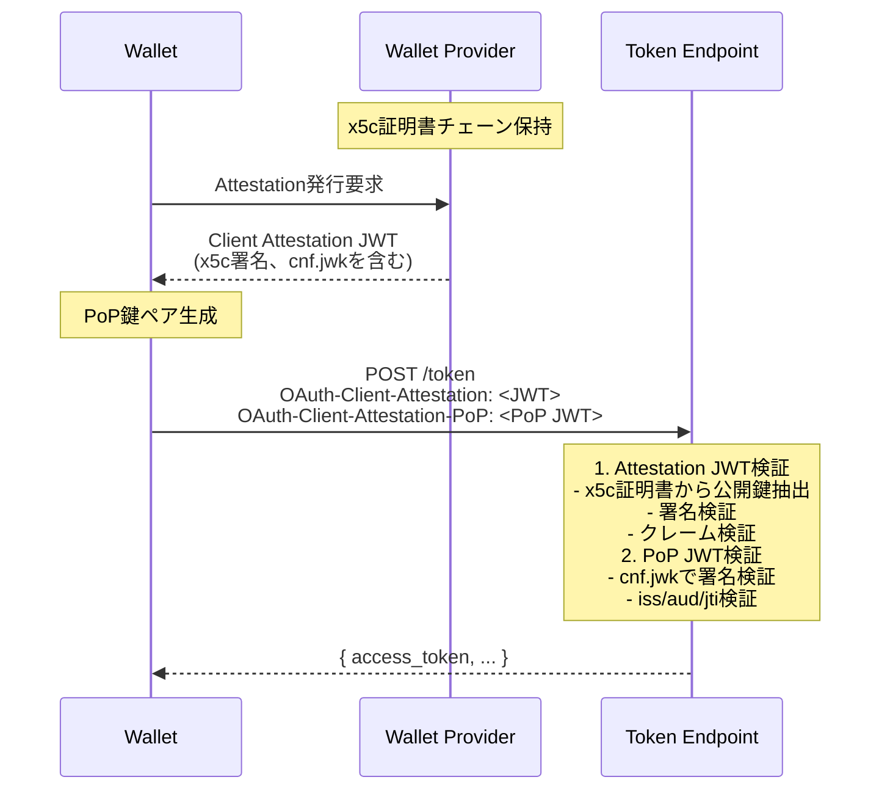

# クライアント認証（Wallet Attestation）

本ライブラリは OAuth 2.0 Attestation-Based Client Authentication に準拠したクライアント認証（Wallet Attestation）をサポートしている。これにより、クレデンシャル発行時に Wallet の真正性を検証できる。

## 概要

Wallet Attestation は、Wallet Provider が Wallet に対して発行する証明書である。Credential Issuer はこの Attestation を検証することで、リクエストが正規の Wallet から送信されていることを確認できる。

## 認証フロー



## JWT 構造

### Client Attestation JWT

Wallet Provider が発行する JWT。HAIP 仕様に基づき、`x5c`ヘッダーが必須。

| 項目      | 説明                                       |
| --------- | ------------------------------------------ |
| `typ`     | `oauth-client-attestation+jwt`             |
| `alg`     | 署名アルゴリズム（ES256, ES384, ES512 等） |
| `x5c`     | 証明書チェーン（Base64 DER 形式）**必須**  |
| `iss`     | Wallet Provider URL                        |
| `sub`     | Wallet client_id                           |
| `exp`     | 有効期限                                   |
| `cnf.jwk` | PoP 検証用公開鍵                           |

### Client Attestation PoP JWT

Wallet が`cnf.jwk`の秘密鍵で署名する JWT。

| 項目  | 説明                               |
| ----- | ---------------------------------- |
| `typ` | `oauth-client-attestation-pop+jwt` |
| `alg` | 署名アルゴリズム                   |
| `iss` | Attestation の`sub`と同一          |
| `aud` | Credential Issuer URL              |
| `jti` | リプレイ防止用一意 ID              |
| `iat` | 発行時刻                           |

## 検証処理

### 1. Attestation JWT 検証

```
1. JWTヘッダーデコード
2. typ = "oauth-client-attestation+jwt" 確認
3. アルゴリズム確認（許可リストに含まれるか）
4. x5cヘッダー存在確認
5. x5c[0]から公開鍵抽出
6. x5c証明書チェーン検証（オプション）
7. JWT署名検証
8. 必須クレーム検証（iss, sub, exp, cnf.jwk）
9. 有効期限検証
```

### 2. PoP JWT 検証

```
1. JWTヘッダーデコード
2. typ = "oauth-client-attestation-pop+jwt" 確認
3. アルゴリズム確認
4. cnf.jwkから公開鍵インポート
5. JWT署名検証
6. 必須クレーム検証（iss, aud, jti, iat）
7. iss = Attestation.sub 確認
8. aud = Credential Issuer URL 確認
9. iat許容範囲確認
10. jtiリプレイ検出（オプション）
```

## 使用方法

### TokenIssuerConfig 設定

```typescript
const config: TokenIssuerConfig = {
  authCodeStateProvider,
  accessTokenIssuer,
  clientAuthentication: {
    enabled: true,
    issuerAudience: "https://issuer.example.com",
    // オプション
    allowedAlgorithms: ["ES256", "ES384", "ES512"],
    iatToleranceSeconds: 300,
    x5cValidator: async (x5cChain) => {
      // 証明書チェーン検証ロジック
      return { valid: true };
    },
    jtiValidator: async (jti) => {
      // リプレイ検出ロジック
      return true; // 新規jtiならtrue
    },
  },
};
```

### 認証コードレベルでの制御

クライアント認証の要否は認証コード（Pre-authorized code）ごとに設定可能。

```typescript
// authCodeStateProviderで返却
return {
  exists: true,
  payload: {
    authorizedCode: {
      ...preAuthCode,
      requireClientAuth: true, // このコードではクライアント認証必須
    },
  },
};
```

## 関連ファイル

| ファイル                                                                                                                            | 説明                 |
| ----------------------------------------------------------------------------------------------------------------------------------- | -------------------- |
| [`src/oid4vci/clientAuthentication/types.ts`](../../../src/oid4vci/clientAuthentication/types.ts)                                   | 型定義               |
| [`src/oid4vci/clientAuthentication/validateAttestation.ts`](../../../src/oid4vci/clientAuthentication/validateAttestation.ts)       | Attestation JWT 検証 |
| [`src/oid4vci/clientAuthentication/validateAttestationPoP.ts`](../../../src/oid4vci/clientAuthentication/validateAttestationPoP.ts) | PoP JWT 検証         |
| [`src/oid4vci/clientAuthentication/extractHeaders.ts`](../../../src/oid4vci/clientAuthentication/extractHeaders.ts)                 | HTTP ヘッダー抽出    |
| [`src/oid4vci/clientAuthentication/index.ts`](../../../src/oid4vci/clientAuthentication/index.ts)                                   | 統合検証関数         |

## 関連仕様

- [OAuth 2.0 Attestation-Based Client Authentication](https://drafts.oauth.net/draft-ietf-oauth-attestation-based-client-auth/draft-ietf-oauth-attestation-based-client-auth.html)
- [OID4VCI Appendix E - Wallet Attestations](https://openid.net/specs/openid-4-verifiable-credential-issuance-1_0.html#appendix-E)
- [HAIP 4.4.1 - Wallet Attestation](https://openid.net/specs/openid4vc-high-assurance-interoperability-profile-1_0-05.html#name-wallet-attestation)
