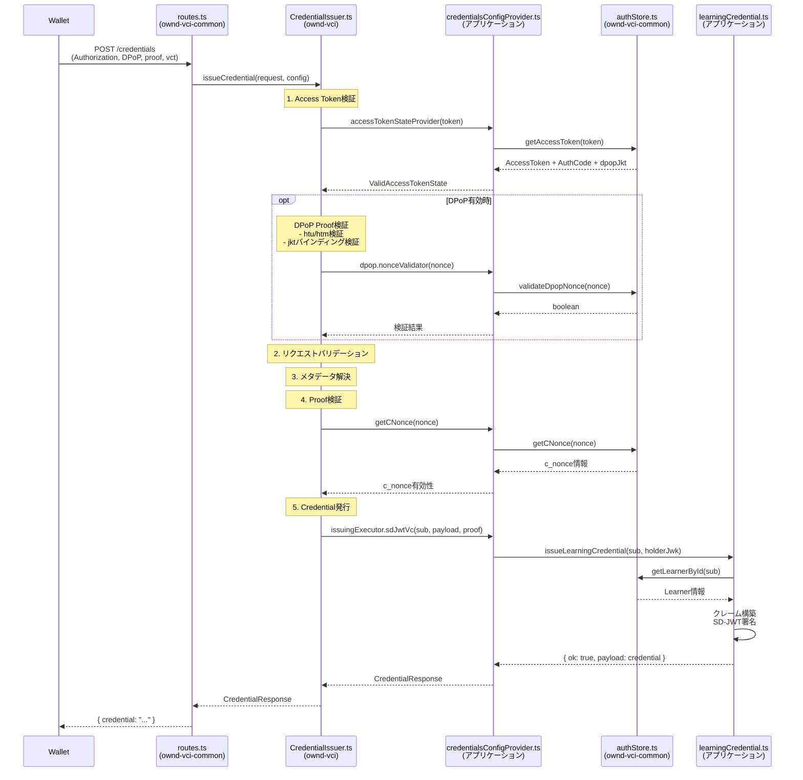

# CredentialIssuer

**ファイル**: [`src/oid4vci/credentialEndpoint/CredentialIssuer.ts`](../../../src/oid4vci/credentialEndpoint/CredentialIssuer.ts)

Access Tokenを検証し、Credentialを発行する。

## 処理フロー
1. `Authorization`ヘッダーからAccess Tokenを検証（`authenticate.ts`）
2. リクエストボディのバリデーション
3. `credential_configuration_id`からメタデータを解決
4. Proof（Key Binding）の検証（`validateProof.ts`）
   - JWT形式のProofをサポート
   - c_nonceの検証（`getCNonce`コールバック使用）
5. フォーマットに応じた発行処理を実行

## サポートするCredentialフォーマット

| フォーマット | 状態 |
|-------------|------|
| `dc+sd-jwt` | サポート |
| `jwt_vc_json` | サポート |
| `ldp_vc` | 未サポート |
| `jwt_vc_json-ld` | 未サポート |

## Config型

```typescript
interface CredentialIssuerConfig<T> {
  credentialIssuer: string;           // Issuer識別子URL
  issuerMetadata: IssuerMetadata;     // Issuerメタデータ
  supportAnonymousAccess?: boolean;   // 匿名アクセスのサポート

  // Access Tokenの状態を取得するコールバック
  accessTokenStateProvider: AccessTokenStateProvider<T>;

  // Credential発行を実行するコールバック
  issuingExecutor: {
    jwtVcJson?: IssueJwtVcJsonCredential;
    sdJwtVc?: IssueSdJwtVcCredential;
  };

  // c_nonceを検証するためのコールバック
  getCNonce?: (nonce: string) => Promise<{
    nonce: string;
    expired_in: number;
    createdAt: string;
  } | undefined>;

  // DPoP設定（オプション）
  dpop?: CredentialDpopConfig;
}

// Credential Endpoint用DPoP設定
interface CredentialDpopConfig {
  enabled: boolean;                   // DPoPサポートを有効化
  required?: boolean;                 // DPoP必須化（デフォルト: false、トークンバインディングに従う）
  allowedAlgorithms?: string[];       // 許可する署名アルゴリズム
  iatToleranceSeconds?: number;       // iat許容範囲（デフォルト: 300秒）
  credentialEndpointUrl: string;      // Credential EndpointのURL（htu検証用）
  // DPoP nonce検証（Nonce Endpointで発行されたnonceを検証）
  nonceValidator?: (nonce: string) => Promise<boolean>;
}

// Access Tokenの状態（DPoPバインディング情報を含む）
interface ValidAccessTokenState<T> {
  expiresIn: number;
  createdAt: Date;
  authorizedCode: { code: string; sub: string };
  storedAccessToken: T;
  dpopJkt?: string;  // DPoP JWK Thumbprint（トークン発行時にバインドされた鍵）
}
```

## Proof検証（validateProof.ts）

JWT形式のProofを検証する。検証項目:
- `typ`: `openid4vci-proof+jwt`であること
- `jwk`: ヘッダーに公開鍵が含まれること
- `aud`: Credential Issuer URLと一致すること
- `iat`: 現在時刻から許容範囲内であること（5秒）
- `nonce`: c_nonceが有効かつ未期限であること

## モジュール連携シーケンス



## 実装例（DPoP対応）

**ファイル:** `src/logic/credentialsConfigProvider.ts`

```typescript
// demos/learning-vci/src/logic/credentialsConfigProvider.ts より引用
import authStore, { StoredAccessToken } from "ownd-vci-common/dist/store/authStore.js";
import {
  CredentialIssuerConfig,
  IssueSdJwtVcCredential,
  DecodedProofJwt,
} from "ownd-vci/dist/oid4vci/credentialEndpoint/types.js";
import {
  CredentialRequestVcSdJwt,
  IssuerMetadataVcSdJwt,
} from "ownd-vci/dist/oid4vci/types/protocol.types.js";

import learningCredential from "./learningCredential.js";
import { accessTokenStateProvider } from "ownd-vci-common/dist/oid4vci/credentialEndpoint/defaults/accessToken.js";

/**
 * SD-JWT VC発行関数
 * vctに応じて適切なCredential発行ロジックを呼び出す
 */
const issueSdJwtVcCredential: IssueSdJwtVcCredential = async (
  sub: string,
  payload: CredentialRequestVcSdJwt,
  proofOfPossession?: DecodedProofJwt,
) => {
  // Proofの検証
  if (
    !proofOfPossession ||
    !proofOfPossession.jwt?.header?.jwk
  ) {
    return { ok: false, error: { error: "invalid_or_missing_proof" } };
  }

  const vct = payload.vct;

  // vctに応じて発行処理を分岐
  if (vct === "urn:eu.europa.ec.eudi:learning:credential:1") {
    return await learningCredential.issueLearningCredential(
      sub,
      proofOfPossession.jwt.header.jwk,
    );
  } else {
    return { ok: false, error: { error: "unsupported_credential_type" } };
  }
};

/**
 * Issuerメタデータ定義
 */
const issuerMetadata: IssuerMetadataVcSdJwt = {
  credential_issuer: process.env.CREDENTIAL_ISSUER || "",
  credential_endpoint: `${process.env.CREDENTIAL_ISSUER}/credentials`,
  credential_configurations_supported: {
    LearningCredential: {
      format: "dc+sd-jwt",
      scope: "LearningCredential",
      vct: "urn:eu.europa.ec.eudi:learning:credential:1",
      // 他の設定...
    },
  },
};

/**
 * c_nonce検証用ラッパー
 */
const getCNonceWrapper = async (nonce: string) => {
  const result = await authStore.getCNonce(nonce);
  if (!result) return undefined;
  return { ...result, createdAt: result.createdAt.toString() };
};

/**
 * DPoP nonce検証用ラッパー
 * Nonce Endpointで発行されたDPoP nonceを検証
 */
const dpopNonceValidator = async (nonce: string): Promise<boolean> => {
  return await authStore.validateDpopNonce(nonce);
};

/**
 * CredentialIssuer設定を生成（DPoP有効）
 */
export const configure = (): CredentialIssuerConfig<StoredAccessToken> => {
  return {
    credentialIssuer: process.env.CREDENTIAL_ISSUER || "",
    issuerMetadata: issuerMetadata,
    supportAnonymousAccess: true,
    accessTokenStateProvider: accessTokenStateProvider,
    issuingExecutor: { sdJwtVc: issueSdJwtVcCredential },
    getCNonce: getCNonceWrapper,
    // DPoP設定
    dpop: {
      enabled: true,
      required: false,  // トークンバインディングに従う
      credentialEndpointUrl: process.env.CREDENTIAL_ISSUER + "/credentials",
      // DPoP nonce検証（Nonce Endpointで発行されたnonceを検証）
      nonceValidator: dpopNonceValidator,
    },
  };
};
```

## ポイント

- `accessTokenStateProvider`: Access Tokenの状態取得時に`dpopJkt`も取得（トークンバインディング検証用）
- `dpop.nonceValidator`: Nonce Endpointで発行されたDPoP nonceの有効性を検証
- `dpop.credentialEndpointUrl`: DPoP ProofのhtuクレームとHTTP URIの一致検証に使用

## Credential発行ロジックの実装例

**ファイル:** `src/logic/learningCredential.ts`

```typescript
// demos/learning-vci/src/logic/learningCredential.ts より引用（簡略化）
import * as jose from "jose";
import { issueCredentialCore } from "@ownd-project/ts-toolbox";
import { DisclosureFrame } from "@meeco/sd-jwt";
import store from "../store.js";
import keyStore from "ownd-vci-common/dist/store/keyStore.js";

const issueLearningCredential = async (
  sub: string,
  holderJwk: jose.JWK,
) => {
  // 1. 発行対象のデータを取得
  const learner = await store.getLearnerById(sub);
  if (!learner) {
    return { ok: false, error: { error: "NotFound" } };
  }

  // 2. 署名鍵を取得
  const keyPair = await keyStore.getLatestKeyPair();
  if (!keyPair) {
    return { ok: false, error: { error: "No keypair exists" } };
  }

  // 3. クレームを構築
  const claims = {
    iss: process.env.CREDENTIAL_ISSUER_IDENTIFIER,
    iat: Math.floor(Date.now() / 1000),
    exp: Math.floor(Date.now() / 1000) + 60 * 60 * 24 * 365,
    vct: "urn:eu.europa.ec.eudi:learning:credential:1",
    cnf: { jwk: holderJwk },  // Holder Binding
    // Credentialのクレーム
    family_name: learner.familyName,
    given_name: learner.givenName,
    issuing_authority: learner.issuingAuthority,
    // 他のクレーム...
  };

  // 4. Selective Disclosure対象を指定
  const disclosureFrame: DisclosureFrame = {
    _sd: ["family_name", "given_name"],
  };

  // 5. SD-JWTを発行
  const credential = await issueCredentialCore(
    claims,
    disclosureFrame,
    keyPair,  // 署名鍵
    [],       // x5c証明書チェーン（空の場合はjwkモード）
  );

  return { ok: true, payload: credential };
};

export default { issueLearningCredential };
```
