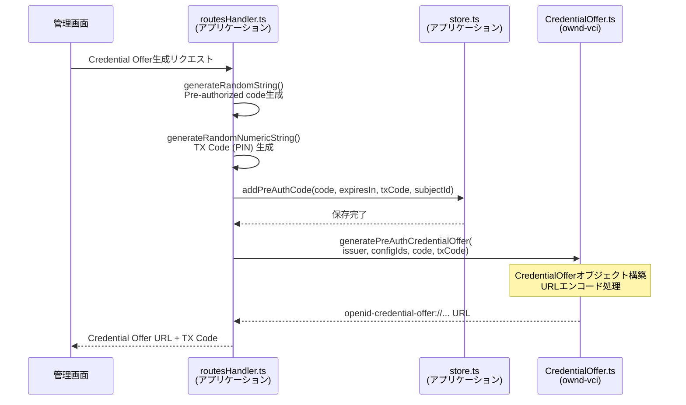

# CredentialOffer

**ファイル**: [`src/oid4vci/CredentialOffer.ts`](../../../src/oid4vci/CredentialOffer.ts)

Credential Offer URLの生成・パースを行うユーティリティ。Walletに対してCredential発行を開始するためのURLを生成する。

## 主要関数

```typescript
// Credential OfferオブジェクトをURLに変換
credentialOffer2Url(offer: CredentialOffer, endpoint?: string): string

// URLからCredential Offerオブジェクトを抽出
url2CredentialOffer(url: string): CredentialOffer

// Pre-Authorized Code Flow用のOffer URLを生成
generatePreAuthCredentialOffer(
  credentialIssuer: string,
  credentialConfigurationIds: string[],
  preAuthCode: string,
  txCode?: TxCode,
  endpoint?: string
): string
```

## モジュール連携シーケンス



## 実装例

```typescript
// demos/learning-vci/src/routes/admin/routesHandler.ts より引用
import { generatePreAuthCredentialOffer } from "ownd-vci/dist/oid4vci/CredentialOffer.js";
import {
  generateRandomNumericString,
  generateRandomString,
} from "ownd-vci/dist/utils/randomStringUtils.js";

const generateCredentialOffer = async (subjectId: string) => {
  // 1. Pre-authorized codeを生成
  const code = generateRandomString();
  const expiresIn = Number(process.env.VCI_PRE_AUTH_CODE_EXPIRES_IN || "86400");

  // 2. TX Code (PIN) を生成
  const txCode = generateRandomNumericString(6);

  // 3. DBに保存
  await store.addPreAuthCode(code, expiresIn, txCode, subjectId);

  // 4. Credential Offer URLを生成
  const credentialOfferUrl = generatePreAuthCredentialOffer(
    process.env.CREDENTIAL_ISSUER || "",
    ["LearningCredential"],  // credential_configuration_ids
    code,
    { length: 6, input_mode: "numeric" },  // tx_code設定
  );

  return {
    credentialOffer: credentialOfferUrl,
    txCode: txCode,
  };
};
```

## 生成されるCredential Offer URL例

```
openid-credential-offer://?credential_offer=%7B%22credential_issuer%22%3A%22https%3A%2F%2Fexample.com%22%2C%22credential_configuration_ids%22%3A%5B%22LearningCredential%22%5D%2C%22grants%22%3A%7B%22urn%3Aietf%3Aparams%3Aoauth%3Agrant-type%3Apre-authorized_code%22%3A%7B%22pre-authorized_code%22%3A%22abc123...%22%2C%22tx_code%22%3A%7B%22length%22%3A6%2C%22input_mode%22%3A%22numeric%22%7D%7D%7D%7D
```
