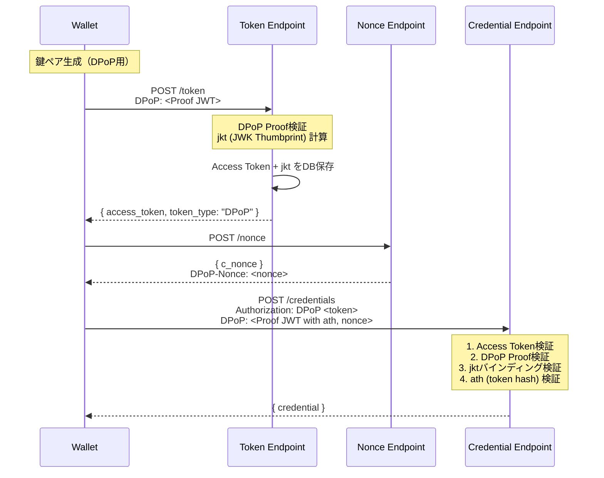

# DPoP（Demonstrating Proof of Possession）

本ライブラリはRFC 9449に準拠したDPoP（Demonstrating Proof of Possession）をサポートしている。DPoPにより、Access Tokenの不正使用（トークン漏洩時の悪用）を防止できる。

## DPoP対応フロー



## Access Tokenの実装方式

RFC 9449では、DPoP-boundなAccess Tokenの確認方法（Confirmation Method）として以下の2つが定義されている。

| 方式 | RFCセクション | Access Token形式 | jkt（JWK Thumbprint）の格納場所 | 検証方法 |
|------|--------------|-----------------|-------------------------------|----------|
| JWT方式 | Section 6.1 | JWT | トークン内の`cnf.jkt`クレーム | トークン自己検証 |
| Introspection方式 | Section 6.2 | Opaque | Token Introspectionレスポンス | 認可サーバーへの問い合わせ |

### 本ライブラリの実装: Opaqueトークン + DB参照

本ライブラリでは**Opaqueトークン**を採用している。

RFC 9449 Section 6.2では、Opaqueトークンの場合はリソースサーバーが認可サーバーのToken Introspectionエンドポイントに問い合わせて`cnf.jkt`を取得する方式が定義されている。しかし、本ライブラリでは認可サーバー（Token Endpoint）とリソースサーバー（Credential Endpoint）が同一サーバーで動作することを想定しているため、**Token Introspectionの代わりにDB参照**でjktを取得している。

```
┌─────────────────────────────────────────────────────────────────┐
│ Token Endpoint                                                  │
├─────────────────────────────────────────────────────────────────┤
│  1. DPoP Proof検証 → jkt (thumbprint) 計算                      │
│  2. context.dpopJkt としてコールバックに渡す                      │
│  3. アプリケーション側:                                          │
│     - generateRandomString() でオペークトークン生成              │
│     - jktをDBに保存（access_tokensテーブル）                     │
│  4. レスポンス: { access_token: "xxx", token_type: "DPoP" }     │
└─────────────────────────────────────────────────────────────────┘

┌─────────────────────────────────────────────────────────────────┐
│ Credential Endpoint                                             │
├─────────────────────────────────────────────────────────────────┤
│  1. Access Tokenをキーにしてdbからjktを取得                       │
│     （accessTokenStateProvider経由）                             │
│  2. DPoP Proofのthumbprintと保存済みjktを比較                    │
│  3. 一致すればトークンバインディング検証成功                        │
└─────────────────────────────────────────────────────────────────┘
```

### クライアント（Wallet）への影響

**どちらの方式でもクライアントの動作は同一**である。クライアントはAccess Tokenの内部構造を解釈せず、opaqueな文字列として扱う。

```typescript
// クライアント側の動作（方式によらず同じ）

// 1. Token Endpoint
POST /token
DPoP: <DPoP Proof JWT>
→ { access_token: "xxx", token_type: "DPoP" }

// 2. Credential Endpoint
POST /credentials
Authorization: DPoP xxx
DPoP: <DPoP Proof JWT with ath>
```

### 方式選択の考慮点

| 観点 | JWT方式 | Introspection方式 | 本実装（DB参照） |
|------|---------|-------------------|-----------------|
| 外部リソースサーバー | 自己検証可能 | Introspection必要 | 非対応 |
| 同一サーバー | どちらでも可 | どちらでも可 | 対応 |
| トークンサイズ | 大きい | 小さい | 小さい |
| 実装の複雑さ | JWT署名が必要 | Introspection実装必要 | シンプル |

本ライブラリは同一サーバー構成を想定しているため、DB参照方式を採用している。外部リソースサーバーとの連携が必要な場合は、JWT方式またはToken Introspectionエンドポイントの実装が必要となる。

## 関連ファイル

| ファイル | 説明 |
|----------|------|
| [`src/oid4vci/dpop/validateDpopProof.ts`](../../../src/oid4vci/dpop/validateDpopProof.ts) | DPoP Proof検証（RFC 9449 Section 4.3準拠） |
| [`src/oid4vci/dpop/utils.ts`](../../../src/oid4vci/dpop/utils.ts) | JWK Thumbprint計算、ath計算等 |
| [`src/oid4vci/dpop/types.ts`](../../../src/oid4vci/dpop/types.ts) | DPoP関連の型定義 |
