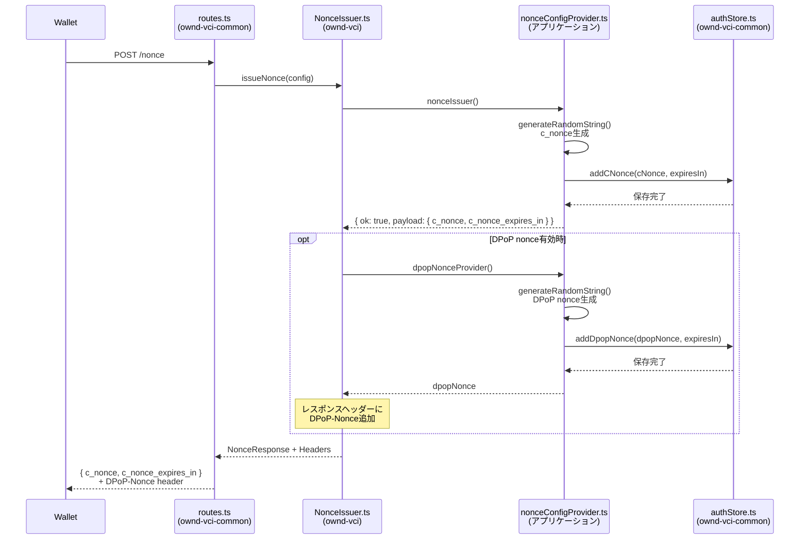

# NonceIssuer

**ファイル**: [`src/oid4vci/nonceEndpoint/NonceIssuer.ts`](../../../src/oid4vci/nonceEndpoint/NonceIssuer.ts)

c_nonceを発行する。Credential Endpoint呼び出し前に必須。

## Config型

```typescript
interface NonceIssuerConfig {
  // c_nonceを生成するコールバック
  nonceIssuer: NonceIssuer;
  // DPoP nonce生成（オプション）- DPoP-Nonceヘッダー用
  dpopNonceProvider?: () => Promise<string>;
}

type NonceIssuer = () => Promise<Result<NonceResponse, ErrorPayload>>;
```

**DPoP nonce**: `dpopNonceProvider`を設定すると、レスポンスに`DPoP-Nonce`ヘッダーが追加される。Credential Endpointでのnonce検証に使用される。

## モジュール連携シーケンス



## 実装例（DPoP nonce対応）

**ファイル:** `src/logic/nonceConfigProvider.ts`

```typescript
// demos/learning-vci/src/logic/nonceConfigProvider.ts より引用
import { generateRandomString } from "ownd-vci/dist/utils/randomStringUtils.js";
import authStore from "ownd-vci-common/dist/store/authStore.js";
import {
  NonceIssuer,
  NonceIssuerConfig,
} from "ownd-vci/dist/oid4vci/nonceEndpoint/types.js";

/**
 * c_nonceを発行するコールバック
 */
export const nonceIssuer: NonceIssuer = async () => {
  try {
    const cNonce = generateRandomString();
    const cNonceExpiresIn = Number(process.env.VCI_ACCESS_TOKEN_C_NONCE_EXPIRES_IN);

    await authStore.addCNonce(cNonce, cNonceExpiresIn);

    return {
      ok: true,
      payload: {
        c_nonce: cNonce,
        c_nonce_expires_in: cNonceExpiresIn,
      },
    };
  } catch (err) {
    console.error(err);
    return {
      ok: false,
      error: { error: "INTERNAL_ERROR", internalError: true },
    };
  }
};

/**
 * DPoP nonceを発行するコールバック
 * レスポンスのDPoP-Nonceヘッダーに設定される
 */
const dpopNonceProvider = async (): Promise<string> => {
  const dpopNonce = generateRandomString();
  const expiresIn = Number(process.env.VCI_DPOP_NONCE_EXPIRES_IN || "300");
  await authStore.addDpopNonce(dpopNonce, expiresIn);
  return dpopNonce;
};

/**
 * NonceIssuer設定を生成（DPoP nonce対応）
 */
export const nonceConfigure = (): NonceIssuerConfig => {
  return {
    nonceIssuer,
    // DPoP nonce生成（レスポンスにDPoP-Nonceヘッダーを追加）
    dpopNonceProvider,
  };
};
```

## ポイント

- `dpopNonceProvider`: DPoP nonce（`DPoP-Nonce`ヘッダー用）を生成してDBに保存
- Credential Endpoint呼び出し時にDPoP Proofの`nonce`クレームで使用される
