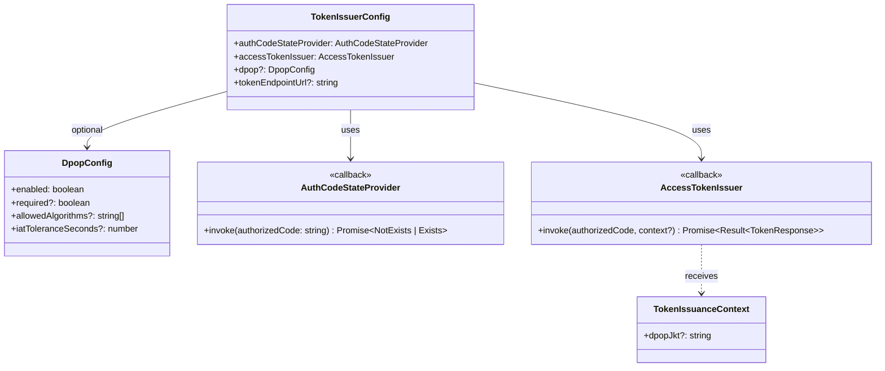
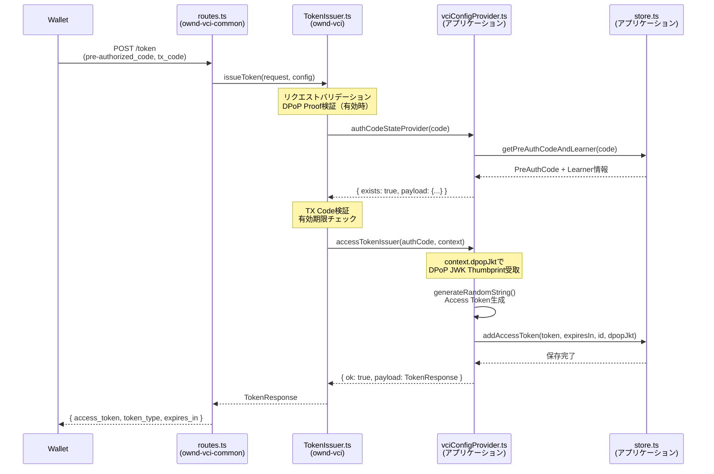

# TokenIssuer

**ファイル**: [`src/oid4vci/tokenEndpoint/TokenIssuer.ts`](../../../src/oid4vci/tokenEndpoint/TokenIssuer.ts)

Pre-authorized codeを検証し、Access Tokenを発行する。

## 処理フロー
1. リクエストのバリデーション（`validate.ts`）
2. `AuthCodeStateProvider`で認可コードの状態を取得
3. `AccessTokenIssuer`でAccess Tokenを発行

## Config型



```typescript
interface TokenIssuerConfig {
  // 認可コードの状態を取得するコールバック
  authCodeStateProvider: AuthCodeStateProvider;
  // Access Tokenを発行するコールバック
  accessTokenIssuer: AccessTokenIssuer;
  // DPoP設定（オプション）
  dpop?: DpopConfig;
  // Token EndpointのURL（DPoP有効時に必須、htu検証用）
  tokenEndpointUrl?: string;
}

interface DpopConfig {
  enabled: boolean;              // DPoPサポートを有効化
  required?: boolean;            // 全リクエストでDPoPを必須化（デフォルト: false）
  allowedAlgorithms?: string[];  // 許可する署名アルゴリズム
  iatToleranceSeconds?: number;  // iat許容範囲（デフォルト: 300秒）
}

// Access Token発行時のコンテキスト（DPoPバインディング等）
interface TokenIssuanceContext {
  dpopJkt?: string;  // DPoP JWK Thumbprint（DPoP Proof検証成功時に設定）
}

// 認可コードの存在と状態を返す
type AuthCodeStateProvider = (
  authorizedCode: string,
) => Promise<NotExists | Exists<PayloadAtExists>>;

// Access Tokenを発行して返す（contextでDPoP情報を受け取る）
type AccessTokenIssuer = (
  authorizedCode: AuthorizedCodeWithStoredData,
  context?: TokenIssuanceContext,
) => Promise<Result<TokenResponse, ErrorPayload>>;
```

## モジュール連携シーケンス



## 実装例（DPoP対応）

**ファイル:** `src/logic/vciConfigProvider.ts`

```typescript
// demos/learning-vci/src/logic/vciConfigProvider.ts より引用
import { generateRandomString } from "ownd-vci/dist/utils/randomStringUtils.js";
import store from "../store.js";
import {
  AccessTokenIssuer,
  AuthCodeStateProvider,
  AuthorizedCodeWithStoredData,
  TokenIssuerConfig,
  TokenIssuanceContext,
} from "ownd-vci/dist/oid4vci/tokenEndpoint/types.js";

/**
 * 認可コードの状態を提供するコールバック
 * pre-authorized_codeがDBに存在するか、使用済みかを確認する
 */
export const authCodeStateProvider: AuthCodeStateProvider = async (
  authorizedCode: string,
) => {
  const result = await store.getPreAuthCodeAndLearner(authorizedCode);
  if (!result) {
    return { exists: false };
  }
  const { storedAuthCode } = result;
  const { usedAt, ...rest } = storedAuthCode;
  return {
    exists: true,
    payload: {
      authorizedCode: {
        ...rest,
        isUsed: usedAt !== null,
        storedData: { id: storedAuthCode.id },
      },
    },
  };
};

/**
 * Access Tokenを発行するコールバック
 * DPoP Proof検証成功時はcontext.dpopJktが設定される
 */
export const accessTokenIssuer: AccessTokenIssuer = async (
  authorizedCode: AuthorizedCodeWithStoredData,
  context?: TokenIssuanceContext,
) => {
  const newAccessToken = generateRandomString();
  const expiresIn = Number(process.env.VCI_ACCESS_TOKEN_EXPIRES_IN);

  try {
    // DPoP JWK Thumbprint (jkt) をAccess Tokenと共に保存
    // Credential Endpoint呼び出し時にトークンバインディング検証に使用
    await store.addAccessToken(
      newAccessToken,
      expiresIn,
      authorizedCode.storedData.id,
      context?.dpopJkt,  // DPoP使用時に設定される
    );

    return {
      ok: true,
      payload: {
        access_token: newAccessToken,
        // DPoP使用時は"DPoP"、それ以外は"Bearer"
        token_type: context?.dpopJkt ? "DPoP" : "Bearer",
        expires_in: expiresIn,
      },
    };
  } catch (err) {
    console.error(err);
    return {
      ok: false,
      error: { error: "INTERNAL_ERROR", internalError: true },
    };
  }
};

/**
 * TokenIssuer設定を生成（DPoP有効）
 */
export const tokenConfigure = (): TokenIssuerConfig => {
  return {
    authCodeStateProvider,
    accessTokenIssuer,
    // DPoP設定
    dpop: {
      enabled: true,
      required: false,  // DPoPはオプション（Bearer Tokenも許可）
    },
    tokenEndpointUrl: process.env.CREDENTIAL_ISSUER + "/token",
  };
};
```

## ポイント

- `authCodeStateProvider`: DBから認可コードを取得し、存在・使用状態を返す
- `accessTokenIssuer`: Access Token発行時に`context.dpopJkt`でDPoP JWK Thumbprintを受け取り、DBに保存
- `tokenConfigure`: `dpop.enabled: true`でDPoPサポートを有効化、`tokenEndpointUrl`はhtu検証に使用
